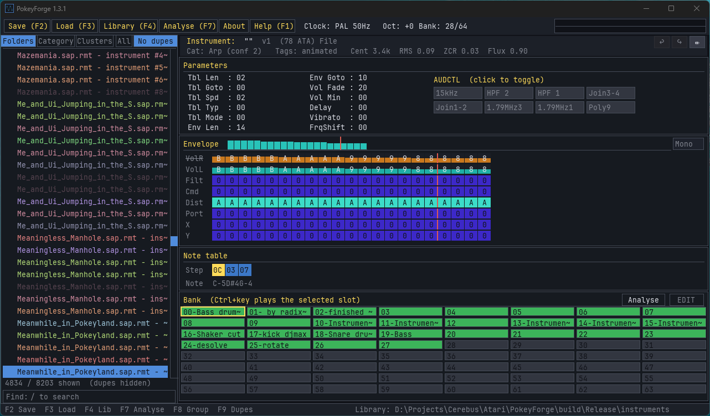

# PokeyForge

**Audition, inspect, and curate Atari RMT instrument files.**

PokeyForge is a standalone Windows tool for working with `.RTI` files — the
instrument format used by [Raster Music Tracker (RMT)](https://en.wikipedia.org/wiki/Raster_Music_Tracker)
on the Atari 8-bit. It lets you:

- **Browse** a whole folder tree of `.RTI` files at once.
- **Play** any instrument across the keyboard at different pitches, so you can
  hear what it actually sounds like without opening each one in RMT.
- **Inspect** an instrument's internals — its parameters, AUDCTL flags,
  envelope, and note table — laid out on a single screen.
- **Edit** an instrument in place: move a cursor through any field, type new
  values, rename it, and hear the change immediately.
- **Collect** the ones you like into a 64-slot *bank*, audition any slot, then
  **save** it as both a set of individual `.RTI` files and a single `.RMT`
  module that RMT can open.
- **Reload** a saved bank later, **switch** between instrument libraries, and
  pick up where you left off — PokeyForge remembers your last library and the last
  instrument you were on.



The sound is produced by the exact same emulation RMT itself uses (the Altirra
POKEY and 6502 cores plus the RMT tracker driver), so what you hear in PokeyForge
is what you'll hear in RMT.

> **How edits are saved:** PokeyForge never overwrites your original `.RTI` files.
> Edits live in a working copy; to keep them, put the instrument in the bank
> (`+` or `Ctrl+Ins`) and save the bank (`F2`). Anything modified-but-unsaved is
> marked **orange** so you can see what still needs saving.

---

## Features

**Authentic sound**
- Plays instruments through the **real RMT signal chain** — an emulated 6502
  running the RMT tracker driver into an Altirra-grade POKEY core — so the
  output matches Atari hardware and RMT itself.
- **PAL/NTSC** clock toggle; **±octave** transposition.
- Live **master oscilloscope** showing the channel-1 waveform as it plays.

**Browse a whole library at once**
- Recursive folder scan of every `.RTI` under a directory.
- Multiple list views: **Folders**, **By Category**, **All**, and **No dupes**.
- **Type-to-search** filter bar to jump to an instrument by name.
- Automatic **categorisation** (bass / lead / percussion / noise-FX / pad) and
  **duplicate detection** across the library.
- **Directory scrollbar** with a draggable thumb on the right edge of the tree
  pane — drag, click the track to page, or use arrow keys.
- The category/folder containing the current selection auto-expands so the
  highlighted instrument is never hidden under a collapsed parent.
- **Right-click** any directory entry to drop it straight into the bank
  (same effect as `+`, but without changing the instrument you're editing —
  and sound-identical duplicates are detected and just highlighted rather
  than re-added).
- **Drag-and-drop** a folder or a single `.RTI` onto the window to load it.

**Audition**
- Play any instrument chromatically across the keyboard (`a–z`, `0–9`).
- Browse with the arrow keys / mouse wheel; `Esc` silences without exiting.
- Sample any **bank slot** in place with `Ctrl` + an audition key.

**Inspect & edit**
- Every instrument laid out on one screen: **parameters**, **AUDCTL** flags,
  **envelope**, and **note table**.
- Move a cursor through any field and edit with **hex/decimal entry**,
  **Shift+↑/↓ nudge**, or right-click **bit toggles** — and hear the change
  immediately.
- **Rename** instruments inline.
- Full **undo / redo** (`Ctrl+Z` / `Ctrl+Y`).
- **Export** an edited instrument as a new standalone `.RTI` (`Ctrl+S`).

**Build a bank**
- Curate a **64-slot bank**; copy / cut / paste / reorder slots in EDIT mode.
- **Right-click any bank slot** for a context menu (New / Clear / Export RTI /
  Import RTI) — build instruments from scratch, replace a slot in place, or
  export a single slot to a standalone `.rti`. Clear and Export are greyed
  out on empty slots; hovered items light up so it's obvious which option
  you're about to pick.
- Save the bank as a set of individual `.RTI` files **and** a single
  RMT-compatible **`.RMT`** module (plus a manifest).
- **Reload** a saved bank, **switch libraries** on the fly, and resume where you
  left off — the last library, bank, and instrument are remembered between runs.

**Standalone & self-contained**
- Single Windows `.exe`, no installer and no MFC — built in **C++17 with SDL3**.
- App icon, splash screen, in-app **About** and **F1 keybindings** overlay, and
  friendly error dialogs.

---

## Getting started

### Launch with a folder

```
PokeyForge.exe "C:\path\to\your\instruments"
```

PokeyForge scans that folder **and all its subfolders** for `.RTI` files and opens
ready to play the first one.

### Launch with no folder

```
PokeyForge.exe
```

If you've used PokeyForge before, it reopens the **last library** you browsed and
jumps back to the **last instrument** you were on. If there's no remembered
library (first run, or the saved folder no longer exists), a folder-picker
dialog appears — choose the folder containing your `.RTI` files. Cancelling the
dialog on first run exits the program.

You can change libraries any time with `F4` (see *Switching libraries* below).

### Launch with a single file

```
PokeyForge.exe "C:\path\to\bass1.rti"
```

PokeyForge loads the file's parent folder and jumps straight to that file.

---

## The screen at a glance

PokeyForge shows everything on one screen — there are no separate tabs or windows
to switch between. As you move through the directory, every panel updates to
reflect the currently selected instrument.

```
+-----------------------------------------------------------------------+
| [Save F2][Load F3][Library F4][Help F1]   Clock:PAL Oct:+0 Bank:03/64  |  <- Menu bar / header
+--------------------+--------------------------------------------------+
|  Directory         |  Instrument: "bass1" v1 (NN ATA bytes) file:b... |
|                    |--------------------------------------------------|
|  v drums/          |  Parameters         AUDCTL [15kHz][HPF1]...      |
|    B kick.rti      |  Tbl Len : 04  ...                               |
|      snare.rti     |--------------------------------------------------|
|  > leads/          |  Envelope                                        |
|    bass1.rti  <--  |   VolR  [F][F][E][C]...                          |
|    bass2.rti       |   VolL  [F][F][E][C]...                          |
|                    |--------------------------------------------------|
|                    |  Note table   [00][04][08]...                    |
|                    |--------------------------------------------------|
|  12 / 87 files     |  Bank  [00-kick][01-bass][02-..][  ]...          |
+--------------------+--------------------------------------------------+
| F2 Save F3 Load F4 Library | Ctrl+key sample  Ctrl+Ins set  Ctrl+Del  |  <- Command bar
+-----------------------------------------------------------------------+
```

When you turn on **Edit mode** (`F6`), the focused panel gets a bright white
frame and an **edit bar** appears above the command bar, naming the field under
the red cell cursor, its value and range, and what it does.

**Panels:**

| Panel | What it shows |
|-------|---------------|
| **Menu bar / header** | Clickable buttons — **Save (F2)**, **Load (F3)**, **Library (F4)**, **Analyse (F7)**, **About**, **Help (F1)** — plus status (PAL/NTSC clock, octave shift, bank fill count, `[EDIT]` / `MODIFIED`), and a small **live scope** in the top-right corner showing channel 1's waveform as it plays. |
| **Search bar** (bottom of the right column) | Type-to-filter the instrument list by name (press `/` or click it). |
| **Directory** (left) | The folder tree. `>` is a collapsed folder, `v` is expanded. The highlighted row is the instrument you're auditioning. A `B` next to a file means it's in your bank. Long names are shortened with a trailing `~`; the full filename always appears in the instrument header. |
| **Instrument header** | The selected instrument's internal name, RTI version, ATA byte size, and the source **filename** (handy when the tree truncates it). |
| **Parameters** | The instrument's 12 main parameters (table length/goto/speed/type/mode, envelope length/goto, volume fade/min, delay, vibrato, frequency shift) plus the 8 AUDCTL flag toggles. |
| **Envelope** | The 8-row envelope grid (volume left/right, filter, command, distortion, portamento, X, Y) across each step. Brighter cells = higher values. A red marker shows the envelope's loop (goto) point. |
| **Note table** | The instrument's note/frequency table; the loop (goto) step is highlighted. |
| **Bank** | Your 64 collected instruments as an 8×8 grid, each tile labelled `NN-name` (e.g. `00-kick`). Saved slots are green; **orange** slots are added/edited but not yet saved to disk; the slot holding the current instrument has a red border; the **selected** slot (for Ctrl operations) has a yellow outline. |
| **Command bar** (bottom) | Quick reminders of the file/bank actions (`F2 Save`, `F3 Load`, `F4 Library`, the `Ctrl` bank verbs), the current library path, and transient confirmations like *"Saved drums.rmt + 12 .rti"*. |
| **Edit bar** (when editing) | Appears above the command bar in Edit mode: names the focused panel and field, shows its current value + range, and a one-line description of what the field does, plus the editing controls. |

---

## How to use it

### Hearing an instrument

Press any letter or number key to play the **currently selected** instrument
at a pitch:

- `a`–`z` then `0`–`9` form one long chromatic scale — 36 semitones in total,
  from low to high. `a` is the lowest, `9` is the highest.
- Use `[` and `]` to shift the whole keyboard down or up by an octave, so you
  can hear the same instrument in a very low or very high register.

Notes play one at a time. Each instrument plays out according to its own
envelope and fade — you don't need to release the key. Press `Esc` at any time
to cut the sound.

### Moving through the directory

- `←` / `→` or `↑` / `↓` — step to the previous / next instrument. **Hold the
  key** to scroll quickly.
- **Mouse wheel** — fly through the list (3 instruments per notch).
- **Click** any instrument in the tree to select it; click a folder to
  expand/collapse it, or a category header to collapse it.
- `PageUp` / `PageDown` — jump 10 files at a time.
- `Home` / `End` — jump to the first / last file.
- `/` — **search**: start typing to filter the list to instruments whose name
  contains what you type. Arrows still move through the matches; `Enter` keeps
  the filter, `Esc` clears it.
- `Enter` — collapse or expand the folder that the current file lives in, to
  tidy up the tree as you work.

The directory list always wraps around — going past the last file brings you
back to the first (via the arrows) — and every panel refreshes as you move.

### Building a bank

The bank is your shortlist of favourite instruments — up to 64 of them.

**Selecting a slot:** click a bank tile with the mouse, or press `Tab` /
`Shift+Tab` to move the yellow selection cursor. The selected slot is the target
of the `Ctrl` operations below. Clicking a *filled* slot also loads it as the
current instrument (so you can edit it).

**Adding:**

- `+` (or `=`) — add the current instrument to the next free bank slot.
- `Ctrl+Ins` — copy the current instrument into the **selected** slot,
  overwriting whatever was there.

**Auditioning a slot:**

- `Ctrl` + an audition key (`a`–`z` / `0`–`9`) — play the **selected** bank
  slot at that pitch. Plain keys (no `Ctrl`) still play the current instrument,
  so you can A/B the two.

**Removing:**

- `-` — remove the instrument you're currently auditioning from the bank.
- `Ctrl+Del` — remove the **selected** slot. (Plain `Delete` does nothing to the
  bank, to avoid accidental deletions.)

**Right-click context menu:** right-click any slot for a small popup with:

- **New** — replace the slot with a fresh blank instrument (`PAR_TBL_SPEED=1`,
  full-volume pulse on envelope column 0 so it's audible immediately), load it
  as the current instrument, and drop straight into edit mode on its name.
- **Clear** — wipe the slot (with a yes/no confirm). If the cleared slot was
  the current instrument, the engine is silenced and its emulated-RAM page is
  zeroed so a key press can't replay the stale data. Greyed out on empty slots.
- **Export RTI** — save the slot's stored ATA blob to a standalone `.rti` file
  via a Save dialog. Greyed out on empty slots.
- **Import RTI** — load a `.rti` from disk directly into this slot (with a
  confirm if the slot was occupied).

Sound-identical duplicates are detected on every add: if you press `+` or
right-click a directory entry whose ATA blob matches an existing bank slot,
the bank cursor jumps to the existing slot and a notice tells you where —
no second copy is created.

Added or edited slots show **orange** until you save the bank, then turn green.

**Saving:**

- `F2` — opens a standard Windows *Save As* dialog. Type a name and choose a
  location.

PokeyForge then writes **two** things at that location:

- `<name>.rmt` — a single RMT module containing all your bank instruments (with
  a silent placeholder song). Open it directly in RMT; the instruments populate
  the instrument table.
- `<name>_rti/` — a folder of one `.RTI` per filled slot (`00_kick.rti`,
  `01_bass1.rti`, …) plus a `manifest.txt`. Load these individually in RMT with
  *File ▸ Load Instrument*.

**Reordering:**

- `Ctrl+C` copies the selected slot, `Ctrl+X` cuts it, `Ctrl+V` pastes into the
  selected slot. Cut + paste moves an instrument to a different slot.

**Loading:**

- `F3` — opens a file picker. Choose either a `.rmt` file (PokeyForge reads its
  instrument table) or a saved bank's `manifest.txt` (PokeyForge re-reads the
  individual `.RTI` files). The bank is replaced with what you load.
- The **last bank you saved or loaded is reopened automatically** on the next
  launch (remembered in `pokeyforge.json`).

### Editing instruments

Press `F6` to toggle **Edit mode** (the header shows `[EDIT]`). Browse mode is
unchanged; nothing is editable until you turn this on.

In Edit mode:

- The **focused panel** (Parameters, Envelope, Note table, or Name) gets a
  bright white frame, and a red cursor marks the exact cell you're changing. The
  **edit bar** at the bottom names the field, its value and range, and what it
  does.
- `Tab` / `Shift+Tab` — move between the four panels.
- Arrow keys — move the cell cursor.
- `0`–`9`, `A`–`F` — type a value (two-digit fields compose); `+` / `-` nudge by
  one.
- **Mouse wheel** over the instrument panels (anywhere outside the directory
  pane) also nudges the focused field by ±1 — handy for sweeping a single
  parameter without leaving the mouse. Over the directory pane the wheel still
  scrolls the instrument list.
- **Right-click** any binary field — an AUDCTL flag, the table type/mode, or an
  envelope filter/portamento cell — to flip it between 0 and 1 instantly,
  without typing. (Left-click any field to put the cursor there.)
- Switching to a different instrument **exits Edit mode**, fully stops any
  ringing note, and silences the engine so the new instrument starts from a
  clean slate.
- In the **Name** panel, type to insert characters, `Backspace` / `Delete` to
  remove (hold to repeat), arrows to move the caret.
- `Ctrl` + an audition key — hear the instrument you're editing at that pitch;
  `Space` re-triggers the last note. Changes are applied and audible live.
- `Ctrl+Ins` drops the edited instrument into the selected bank slot;
  `Ctrl+Del` clears the selected slot.

Edits never touch your original `.RTI` files. The header shows **MODIFIED**
while a working copy has unsaved changes. `Ctrl+Z` / `Ctrl+Y` undo / redo your
edits. If you navigate to another instrument with unsaved edits, PokeyForge asks
**Keep in bank / Discard / Cancel** (click the buttons or press `K` / `D` / `C`)
— "Keep" stores the edit into the bank, where it stays orange until you save the
bank with `F2`.

To save an edited instrument on its own (not via the bank), press `Ctrl+S` to
**export it as a new `.RTI`** — a Save dialog lets you choose the name and
location. The original file is left untouched.

### Switching libraries

`F4` opens a folder picker so you can point PokeyForge at a different folder of
`.RTI` files without restarting. The tree, file list, and panels refresh to the
new library, and the choice is remembered for next launch. (Your bank is left
untouched when you switch.)

### Analysing & organising

PokeyForge analyses every `.RTI` in your library to:

- **Find duplicates** — two instruments are duplicates if their sound
  definition is byte-identical, *regardless of filename or instrument name*.
  The first one (alphabetically) is kept; the rest are **hidden** from the
  browse list and tree. Your files are never deleted — `F9` shows/hides the
  duplicates again at any time.
- **Categorise** each instrument (Bass / Lead / Percussion / Noise-FX / Pad /
  Other) from its parameters and envelope. `F8` toggles the directory pane
  between the normal **folder view** and a **grouped-by-category** view.

The results are cached in `analysis.json` in the library folder, so the next
time you open that library the categories and de-duplication are restored
automatically.

**When analysis runs.** PokeyForge runs analysis automatically the **first
time** a given library is opened (startup, `F4` Switch Library, or
drag-dropping a folder onto the window) and **whenever the classifier has
been bumped** since the cache was written. A *"Analysing instruments..."*
splash appears while it works — typically a fraction of a second per
hundred files. Subsequent opens with a matching version read the cached
`analysis.json` instantly. **`F7`** (or the **Analyse** menu button) is an
explicit re-run — use it after adding or removing files in the library
folder.

**Cache versioning.** `analysis.json` carries an integer `"version"` field
that's compared against `Analysis::kAnalysisVersion` in the source. When we
ship a release that changes the decision tree or adds a category, the
constant bumps and your cached file is treated as missing — so every user's
library gets re-analysed on the next launch without manual intervention.

**How categorisation works.** PokeyForge runs each `.RTI` through a fixed
set of heuristics over its parameters, envelope, and note table; the checks
fire in order and the first match wins, so a single instrument can only land
in one bucket. The 13 buckets are: **Bass / Lead / Lead (vibrato) / Arp /
Chord / Pad / Bell / Kick / Snare / HiHat / Perc / Swept FX / Noise / FX /
Other**.

Signals used:

| Signal | What it measures |
|--------|------------------|
| **Channel join** | `AUDCTL` bit `JOIN_1_2` or `JOIN_3_4` — POKEY pairs adjacent channels into a 16-bit-period bass voice. |
| **Dominant distortion** | The most common POKEY distortion value (bits 1–3 of `AUDC`) across the *used* envelope columns. `0x0`/`0x8` are noise/poly; `0xA` is the pure tone (square pulse). |
| **Distortion transient** | The distortion at the *first* column compared to the dominant of the rest — a snare hits with a pulse and rings out as noise; this signal catches that pattern. |
| **High-frequency AUDCTL** | `15KHZ`, `179_CH1`, or `179_CH3` bits — POKEY's bell-like / bright modes. |
| **Note table variation** | The number of distinct values in the used range of `noteTable[]`. ≥ 3 distinct values (or ≥ 2 across ≥ 3 entries) is an arp / chord. |
| **Vibrato** | `PAR_VIBRATO` non-zero — periodic pitch wobble applied by the driver. |
| **Filter sweep** | The `FILTER` envelope row is non-constant across the used columns. |
| **Envelope length** | `PAR_ENV_LENGTH` — number of envelope columns the instrument actually plays through. |
| **Loop point** | `PAR_ENV_GOTO < envLen` — does the envelope loop back to an earlier column instead of running once and stopping? |
| **Volume fade** | `PAR_VOL_FADEOUT` — per-frame volume decay applied after the envelope ends. `≥ 8` is a fast fade (short tail). |
| **Filename hint** | Common tokens in the file's name (`kick`, `snare`, `bd`, `hat`, `bass`, `lead`, `pad`, `arp`, `bell`, `fx`, ...) — used **only** when every other rule above has fallen through. |

Decision tree (top-down, first match wins):

1. **Channel join is on** → **Bass**.
2. **Note table has ≥ 3 distinct values (or ≥ 2 with a length of ≥ 3)** → **Arp / Chord** (melodic pattern baked into the instrument).
3. **High-frequency AUDCTL bit set AND distortion is pure tone (`0x0A`)** → **Bell** (bright tonal voices).
4. **Envelope ≤ 5 columns AND fast fade** — drum-kit branch:
    1. Distortion transient between start and tail (noise ↔ pulse) → **Snare**.
    2. Dominant noise AND envelope ≤ 2 → **HiHat** (very short noise hit — hats, shakers, cymbals).
    3. Non-noise distortion AND 2–5 columns → **Kick** (pulsey transient drum).
    4. Anything else short + fast → **Perc** (claps, woodblocks, generic blips).
5. **Filter row sweeps (non-constant) AND not looping** → **Swept FX**.
6. **Dominant noise distortion** (longer than a drum hit) → **Noise / FX**.
7. **Envelope loops AND not fading quickly** → **Pad** (sustaining tones).
8. **Pure-tone dominant AND vibrato non-zero** → **Lead (vibrato)**.
9. **Pure-tone dominant** → **Lead**.
10. **Filename token matches** a known category keyword → that category.
11. Everything else → **Other**.

The classification is still heuristic — treat the categories as a helpful
rough grouping, not a strict taxonomy. Authoritative definitions live in
`src/Analysis.cpp` (`Analysis::Classify`).

**Audio-rendered features (v3).** Beyond the parametric signals above,
PokeyForge now also *renders* each instrument through the engine for
~186 ms at startup-analysis time and pulls back audio features from the
resulting PCM:

| Feature | What it measures |
|--------|------------------|
| **RMS profile** (early / mid / late) | Volume envelope shape - peak-up-front + quiet tail = percussive; sustained mid+late = pad-like. |
| **Zero-crossing rate** | Direct measure of noisiness from the rendered waveform. |
| **Peak position** | Where the loudest sample sits in the window - 0 = attack-heavy, 1 = swelling. |
| **Spectral centroid** | Brightness in Hz (mid-window FFT). Catches bell / mallet sounds whose AUDCTL bits aren't set but which sound bright via high-pitched note tables. |
| **Spectral roll-off** | Frequency below which 85% of the signal energy sits. |
| **Spectral flux** | Frame-to-frame magnitude change - high values mean an evolving / swept timbre. |

These features are conservative: they refine the parametric tree but never
override it on their own. They catch four specific cases the parametric
rules miss: (a) percussive sounds with unusual envelope lengths; (b)
ambiguous-distortion hits where ZCR confirms noise; (c) animated FX with no
explicit FILTER envelope; (d) bright tonal voices whose AUDCTL didn't set
the high-frequency mode.

The audio thread is **paused** while analysis runs, so the shared engine
isn't contended; the live instrument is reloaded when analysis finishes
and audio resumes seamlessly. Analysis time is ~10-30 ms per instrument,
so a 500-file library takes a few seconds. The splash shows a live
**"N / M (X%)"** counter while it works.

**Category colours.** Once a library is analysed, instrument rows in the
directory tree are tinted by their effective category so you can see the
mix at a glance without switching to *Category* view. The palette is
deliberately soft — enough hue separation to read groupings, not enough
to turn the pane into a rainbow:

| Category | Colour |
|---|---|
| **Bass** | Cyan |
| **Lead** | Amber |
| **Lead (vibrato)** | Deeper amber |
| **Arp** | Green-yellow |
| **Chord** | Green |
| **Glide** | Teal |
| **Pad** | Soft purple |
| **Bell** | Pale yellow |
| **Kick** | Pink-red |
| **Snare** | Salmon |
| **HiHat** | Grey-pink |
| **Perc** | Dusty rose |
| **Swept FX** | Light blue-grey |
| **Noise / FX** | Grey-blue |
| **Other** / unanalysed | Default text grey |

A row is **dimmed toward the panel background** when the classifier's
confidence score is 1 (just one signal voted for the result) — those are
your "manual review please" rows. The selection highlight always reads
white-on-accent regardless.

Two extra markers appear next to the file name:

- **`B`** — this instrument is already in your bank.
- **`M`** — this instrument has a **manual category override** (see below).
  `B` takes precedence when both apply.

**Clusters view.** Categories tell you *what kind* of instrument something
is; clusters tell you *which other instruments it sounds like*. After
analysis, PokeyForge runs **k-means** over the 8-dimensional audio-feature
vector of every non-duplicate file and groups the library into N clusters
of sonically-similar instruments. Features are standardised per dimension
before clustering, so the result isn't dominated by whichever feature has
the widest raw range; k-means++ seeding keeps the result deterministic.

- **`F10`** (or the **Clusters** view-tab) groups the directory tree by
  cluster instead of folder or category. Each header reads
  `Cluster N (count)`; unclustered files (duplicates and any that the
  audio render couldn't capture) land in a separate `(unclustered)`
  group at the bottom.
- The number of clusters defaults to `ceil(sqrt(N/2))` clamped to **[3,
  12]** — small libraries get 3 clusters, very large libraries cap at 12.
- **`Ctrl+]`** / **`Ctrl+[`** override the cluster count for the *next*
  analysis run (the notice bar shows the active value). Press **F7** to
  re-analyse with the new k. **`Ctrl+] … Ctrl+[ … Ctrl+[`** back to 0
  goes back to the automatic choice.

Two instruments in the same cluster mean the analyser's audio measurements
(RMS shape, ZCR, spectral centroid / rolloff / flux) sit near each other
in feature space — i.e., they share an overall sonic character, even if
they have different POKEY parameters or live in different categories.

**Manual overrides.** When the classifier puts a file in the wrong bucket,
you can override it without re-running analysis:

- **Right-click any directory file** → **Override category ▸** opens a
  colour-coded picker listing every category plus a *Clear override
  (auto)* row.
- **`Ctrl+R`** on the current file cycles its category through every value
  and then back to "use auto" — fast when you're flipping a few files
  without leaving the keyboard.
- **`Ctrl+Shift+R`** clears every manual override in the library at once
  (with the count shown in the notice bar — there's no confirm, but
  setting overrides again is trivial).

Overrides are persisted as a `manual` field in `analysis.json` and survive
across analysis re-runs. The tree shows an **`M`** marker next to
overridden files; the instrument header's second line shows `Cat: Lead
[M]` so you can see at a glance that the displayed category isn't the
analyser's automatic guess.

**Instrument header readout.** While an instrument is loaded, the panel
header now shows a second line of analysis metadata:

```
Cat: Lead (conf 3)   Tags: bright, animated   Cent 2.1k  RMS 0.15  ZCR 0.22  Flux 0.08
```

- **Cat** — the effective category (manual override beats automatic).
- **conf** — confidence (count of signals that voted for this category).
  `[M]` appears after the category when an override is active.
- **Tags** — the sub-tag bitmask, comma-separated. Tags are *orthogonal*
  to the category and can include `vibrato`, `bright`, `dark`, `loud`,
  `quiet`, `animated`, `highfreq`, `ascending`, `descending`.
- **Cent / RMS / ZCR / Flux** — the four most informative audio features
  cached from the analysis render (centroid in kHz, mean RMS across the
  three windows, zero-crossing rate, spectral flux).

The line is hidden when no analysis data is available yet (a freshly
opened library before its first F7).

**Search by tag.** The search bar accepts a special **`@tag`** syntax
to filter by sub-tag instead of filename:

- `@bright` — only instruments tagged bright.
- `@bright,loud` — only instruments tagged **both** bright **and** loud
  (AND semantics).
- Plain queries (`kick`, `bass1`, …) still do case-insensitive substring
  matching on filenames.

**CSV export.** Every analysis run also writes an
**`analysis_report.csv`** next to `analysis.json`, with one row per
instrument (path, category, confidence, cluster, duplicate flag, tags,
and all 8 audio features). Drop it into Excel / pandas / a script to
slice your library outside the app.

### PAL vs NTSC

`F5` toggles between PAL (50 Hz, European Atari) and NTSC (60 Hz, US Atari).
This subtly changes the pitch and the speed at which envelopes advance — match
it to the system your music targets. PokeyForge starts in PAL.

### Display

- `F11` — toggle fullscreen. The layout scales to fit and stays correct at any
  size.
- `F1` — show or hide the on-screen keybindings. While it's open, `F1` or `Esc`
  closes it.

### Quitting

Close the window (the title-bar close button or `Alt+F4`). `Esc` does **not**
quit — it silences playback so you can stop a long sound without leaving the
app.

---

## Keybindings

**Browsing & auditioning**

| Key | Action |
|-----|--------|
| `a`–`z`, `0`–`9` | Play the current instrument at chromatic pitches (low → high) |
| `[` / `]` | Octave shift down / up |
| `←` / `→` or `↑` / `↓` | Previous / next instrument (hold to repeat) |
| Mouse wheel (over tree) | Move the selection quickly (3 instruments per notch) |
| Mouse wheel (over edit panels) | Nudge the focused field by ±1 (Edit mode only) |
| Click a tree row | Select that instrument (or expand a folder / collapse a category) |
| Right-click a tree row | Add that instrument to the bank (dedups by ATA blob) |
| Drag the directory scrollbar | Free-scroll the tree (click track above/below to page) |
| `PageUp` / `PageDown` | Jump back / forward 10 instruments |
| `Home` / `End` | First / last instrument |
| `/` | Search — filter the list by name (type, `Enter` keeps it, `Esc` clears) |
| `Enter` | Collapse / expand the current file's folder |
| `Esc` | Silence playback (or close the help overlay) |

**Bank**

| Key | Action |
|-----|--------|
| Mouse click | Select a bank slot (filled slot also loads it) |
| `Tab` / `Shift+Tab` | Move the bank selection cursor forward / back |
| `Ctrl` + `←` / `→` | Move the bank cursor by one slot |
| `Ctrl` + `↑` / `↓` | Move the bank cursor by a row (±8) |
| `+` (or `=`) | Add the current instrument to the next free slot |
| `-` | Remove the current instrument from the bank |
| `Ctrl` + `a`–`z`/`0`–`9` | Sample (play) the selected bank slot |
| `Ctrl+Ins` | Copy the current instrument into the selected slot (confirm if occupied) |
| `Ctrl+Del` | Delete the selected slot (confirm) |
| Right-click a slot | Open the context menu (New / Clear / Export RTI / Import RTI) |
| **EDIT** button (bank panel) | Toggle bank-edit: when on, `Ctrl+C/X/V` move slots; when off they play |
| `Ctrl+C` / `Ctrl+X` / `Ctrl+V` | (EDIT on) copy / cut / paste a bank slot (cut + paste = move/reorder) |

**Editing** (`F6` to toggle Edit mode)

| Key | Action |
|-----|--------|
| `F6` | Toggle Edit mode |
| `Tab` / `Shift+Tab` | Move between Parameters / Envelope / Note table / Name |
| Arrows | Move the cell cursor (follows the on-screen grid layout) |
| `0`–`9`, `A`–`F` | Type a value into the cell |
| `+` / `-` or `Shift+↑` / `Shift+↓` | Nudge the value up / down |
| Type / `Backspace` / `Delete` | Edit the name (Name panel; hold to repeat) |
| Left-click a field | Put the edit cursor on that field (enters Edit mode) |
| Right-click a field | Toggle a binary field (AUDCTL flag, type/mode, filter) |
| `Ctrl+Z` / `Ctrl+Y` | Undo / redo the last edit |
| `Ctrl+S` | Export the current instrument as a new `.RTI` file |
| `Ctrl` + key | Audition the instrument being edited; `Space` replays |

**Files & display**

| Key | Action |
|-----|--------|
| `F1` | Toggle on-screen help |
| `F2` | Save the bank (`.rmt` + `.rti` folder) via Save dialog |
| `F3` | Load a bank (`.rmt` file or saved bank folder) |
| `F4` | Switch to a different instrument library folder |
| `F5` | Toggle PAL / NTSC |
| `F7` | Analyse: classify instruments + hide duplicates (writes `analysis.json`) |
| `F8` | Toggle folder view / group-by-category |
| `F9` | Show / hide duplicate instruments |
| `F10` | Toggle Clusters view (k-means group-by-similarity) |
| `Ctrl+R` | Reclassify the current file - cycle its manual override |
| `Ctrl+Shift+R` | Clear every manual override in the library |
| `Ctrl+]` / `Ctrl+[` | Increase / decrease the k-means cluster count (0 = auto) |
| `@bright` in search | Filter by tag (combine with commas: `@bright,loud`) |
| `F11` | Toggle fullscreen |
| **About** button | Show the about / credits popup (any key or click closes it) |
| Drag & drop | Drop a folder (open as library) or a `.RTI` (open its folder + select) onto the window |
| Close window | Quit |

---

## Requirements

- 64-bit Windows.
- The program ships with everything it needs next to the executable: the SDL3
  library, the POKEY and 6502 emulation libraries, and the RMT tracker driver.
  Don't separate `PokeyForge.exe` from those files.
- On first run PokeyForge writes a small `pokeyforge.json` next to the executable to
  remember your last library, last bank, and last instrument. Deleting it just
  resets those memories; it's safe to remove.
- Running **Analyse** (`F7`) writes `analysis.json` into the *library* folder
  (the categories + duplicate list for that folder). It's also safe to delete;
  it just gets regenerated next time you analyse.

---

## Building from source

**Toolchain:** Visual Studio 2022 (v143 toolset), x64, C++17. SDL3 (3.4.8) is
vendored in the repo under `lib/`, so there's nothing extra to install.

```
MSBuild PokeyForge.sln /p:Configuration=Release /p:Platform=x64
```

(or open `PokeyForge.sln` in the IDE and build). The produced executable is
`PokeyForge.exe`.

Output lands in `build\Release\`, and a post-build step copies the runtime
assets (`SDL3.dll`, `sa_pokey.dll`, `sa_c6502.dll`, `rmt_driver_v2.obx`) next to
the exe so it runs in place. See [`tech.md`](tech.md) for the full architecture
and internals.

---

## Roadmap

- **Done:** browse, play, inspect, and build banks; save banks as `.RMT` +
  `.RTI` files; reload banks; switch libraries; remember your place between
  sessions; in-place editing of parameters, envelope, note table, and name with
  live audition and **undo/redo**; bank slot sampling and Ctrl bank operations;
  search, auto-categorisation, and duplicate detection; **directory scrollbar**
  with auto-expansion of the current selection's parent; **right-click context
  menu** on bank slots (New / Clear / Export RTI / Import RTI) with hover
  highlighting; right-click on a directory entry adds it to the bank (ATA-blob
  deduplication); mouse wheel nudges edit fields when over the instrument
  panels.
- **Possible future work:** stereo (8-channel) playback, multi-voice/chord
  audition, and selectable RMT driver versions.

---

## Credits

PokeyForge reuses the audio core from Raster Music Tracker (by Raster / Radek
Štěrba, with later work by VinsCool and others) and the standalone POKEY and
6502 emulators (`sa_pokey.dll`, `sa_c6502.dll`) from Avery Lee's Altirra. PokeyForge
itself is an independent front-end built on top of those components.

---

## License

The PokeyForge application code (everything under `src/`) is released under the
**MIT License** — see [`LICENSE`](LICENSE).
Copyright © 2026 RetroCoder.

The bundled runtime components are **not** covered by that license and remain
under their respective authors' terms:

- **SDL3** — zlib license (Sam Lantinga / the SDL contributors).
- **POKEY & 6502 cores** (`sa_pokey.dll`, `sa_c6502.dll`) and the **RMT tracker
  driver** (`rmt_driver_v2.obx`) originate from Altirra and Raster Music Tracker
  respectively; consult those projects for their licensing. They are
  redistributed here for convenience as PokeyForge depends on them at runtime.

If you intend to redistribute PokeyForge, review the upstream licenses for these
third-party components.
